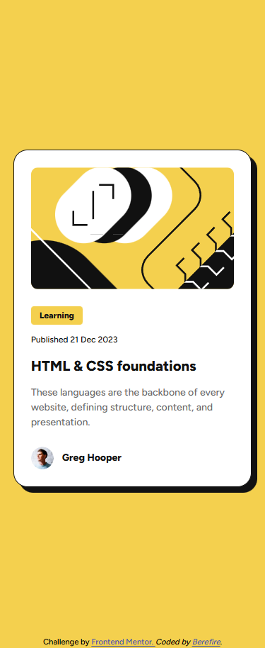
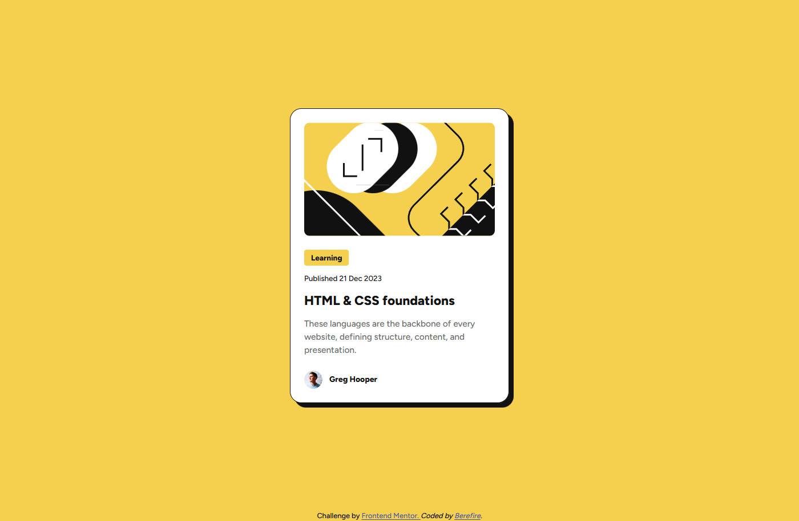
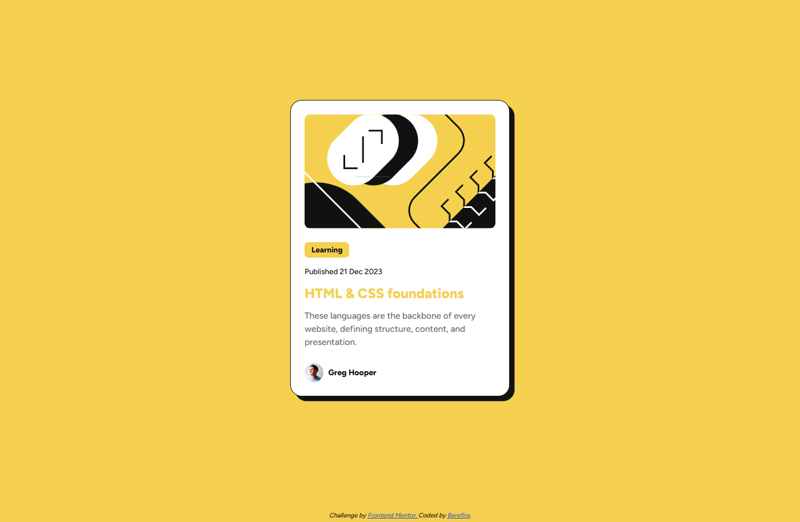

# Frontend Mentor - Blog preview card solution

This is a solution to the [Blog preview card challenge on Frontend Mentor](https://www.frontendmentor.io/challenges/blog-preview-card-ckPaj01IcS). Frontend Mentor challenges help you improve your coding skills by building realistic projects.

---

## Table of contents

- [Overview](#-overview)
  - [The challenge](#-the-challenge)
  - [Screenshot](#screenshot)
  - [Links](#links)
- [My process](#️-my-process)
  - [Built with](#️-built-with)
  - [Features](#-features)
  - [What I learned](#-what-i-learned)
  - [Accessibility](#-accessibility)
  - [Continued development](#-continued-development)
  - [Useful resources](#-useful-resources)
- [Author](#-author)
- [Acknowledgments](#-acknowledgments)

---

## 📋 Overview

The goal of this challenge was to recreate the card layout as closely as possible to the provided design, using semantic HTML, modern CSS, and good accessibility practices.

This project focuses on clean architecture, scalability, and maintainable code using modern CSS methodologies.

---

### 🎯 The challenge

Users should be able to:

- View the optimal layout depending on their device's screen size
- See hover and focus states for all interactive elements on the page
- Navigate the interface using keyboard controls

---

### 📸Screenshot

| _Mobile View (372x914)_                         | _Desktop View (1024x914)_                        |
| ----------------------------------------------- | ------------------------------------------------ |
|  |  |

| _Hover State (1024x914)_                       |
| ---------------------------------------------- |
|  |

---

### 🔗Links

- Solution URL: [https://www.frontendmentor.io/solutions/blog-preview-card---responsive-and-accessible-component-TdWAVGrEr3](https://www.frontendmentor.io/solutions/blog-preview-card---responsive-and-accessible-component-TdWAVGrEr3)
- Live Site URL: [https://berefire.github.io/blog-preview-card/](https://berefire.github.io/blog-preview-card/)

---

## ⚙️ My process

This project was developed following modern frontend best practices, focusing on clean structure, responsive design, and accessibility.

---

### 🛠️ Built with

- Semantic HTML5 markup
- CSS Custom Properties (Design Tokens)
- Flexbox & Grid
- Mobile-first workflow
- CUBE CSS architecture
- BEM methodology
- Accessible markup (WCAG 2.1 AA)
- Fluid typography with `clamp()`

---

### ✨ Features

- Responsive card layout without media queries
- Clean and scalable CSS architecture
- Hover and focus states for all interactive elements
- Keyboard-accessible navigation
- High color contrast and readable typography
- Design tokens for spacing, colors, and typography
- Modular file organization

---

### 📚 What I learned

During this project, I reinforced:

- How to properly structure projects using **CUBE CSS and BEM**
- The importance of using **design tokens** for scalability
- How to implement **fluid typography** with `clamp()`
- Improving accessibility with `aria-labelledby` and `:focus-visible`
- Organizing CSS for long-term maintainability
- Using logical properties for better internationalization support

---

### ♿ Accessibility

This project follows **WCAG 2.1 AA** accessibility guidelines:

- Semantic HTML structure
- Sufficient color contrast
- Keyboard-accessible links
- Visible focus states
- Descriptive alternative text for images
- Proper use of ARIA attributes
- No reliance on color alone for interaction feedback

---

### 🚀 Continued development

In future projects, I would like to:

- Add subtle animations and micro-interactions
- Explore more complex layouts using CSS Grid
- Improve performance optimization techniques
- Continue refining accessibility best practices
- Build larger component-based design systems

---

### 📖 Useful resources

- [MDN Web Docs](https://developer.mozilla.org/)  
  Comprehensive documentation for web standards.

- [CSS-Tricks Flexbox Guide](https://css-tricks.com/snippets/css/a-guide-to-flexbox/)  
  A complete guide to understanding Flexbox.

- [Google Fonts](https://fonts.google.com/)  
  Source for high-quality, free web fonts.

- [CUBE CSS](https://cube.fyi/)  
  Methodology for scalable CSS architecture.

---

## 👤 Author

- Frontend Mentor - [@berefire](https://www.frontendmentor.io/profile/berefire)
- GitHub - [@berefire](https://github.com/berefire)

---

## 🙏 Acknowledgments

Thanks to Frontend Mentor for providing high-quality challenges that help developers grow through consistent practice and real-world projects.

Special thanks to the frontend community for sharing best practices and learning resources.
